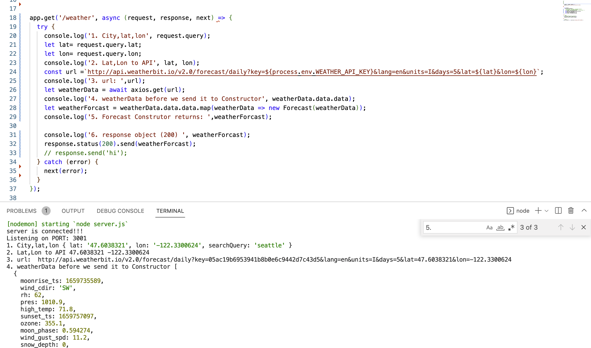
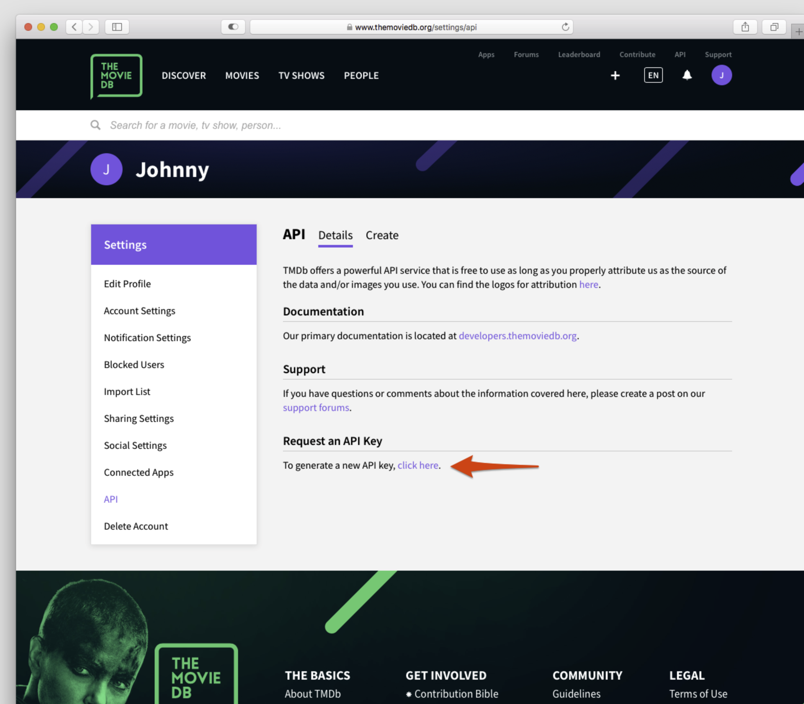
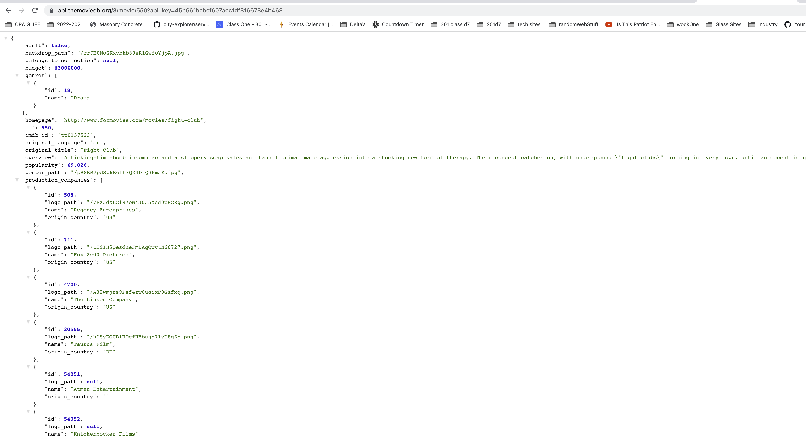
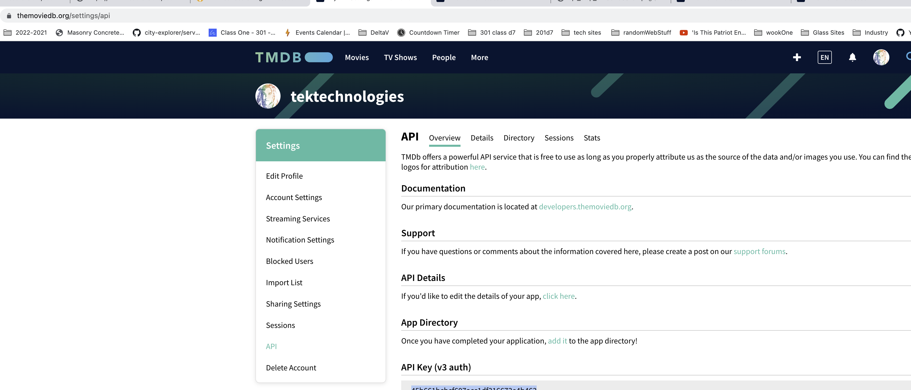
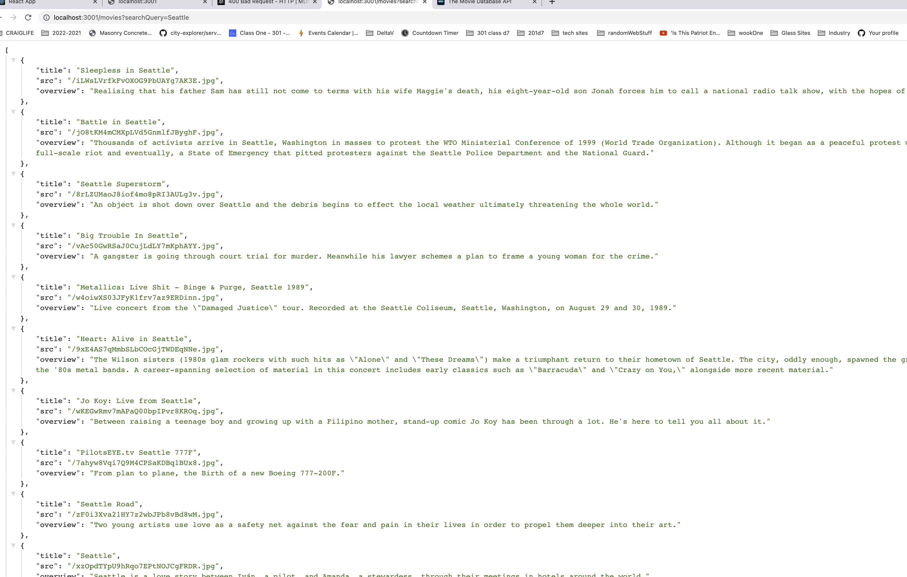

# city-back-end
server file for city front end
## npm init

## weather api call on server 

## documentation for movie site

## test movie api in the documentation 

## Find your key for the movie api 

## test movie in browser look at url to copy before sending to front end.

